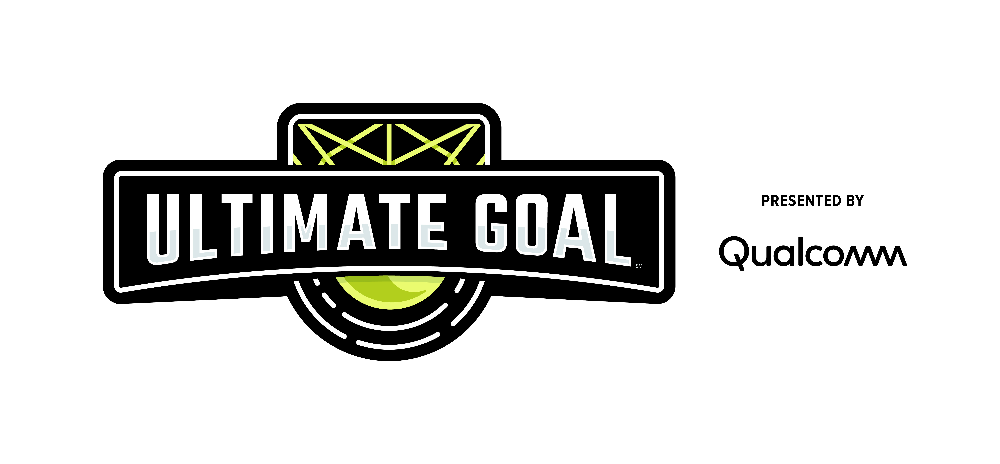

# 最终目标 游戏&赛季材料
注: Ultimate Goal(最终目标)赛季由高通赞助.
作者: [曹饼干老师](https://github.com/ToiletCommander)

## 1.0 游戏手册
注: 中文版游戏手册有时并不是最新版, 如果要查看比赛的最新规则, 请留意裁判长/主裁判的通知和最新的英文版游戏手册.

- [中文版传统比赛游戏手册第一部分](Game%20Manual/gm_part1_traditional_zhCN-20200714.PDF) - 2020/7/14更新
- [中文版传统比赛游戏手册第二部分](Game%20Manual/gm_part2_traditional_zhCN-20200912.PDF) - 2020/9/12更新
- [中文单页比赛介绍](Game%20Manual/game-one-page_zhCN.pdf)
- [英文版传统比赛游戏手册第一部分](Game%20Manual/gm_part1_traditional_enUS-20210203.pdf) - 2021/2/3更新
- [英文版传统比赛游戏手册第二部分](Game%20Manual/gm_part2_traditional_enUS-20210203.pdf) - 2021/2/3更新
- [英文版远程比赛游戏手册第一部分](Game%20Manual/gm_part1_remote_enUS-20210203.pdf) - 2021/2/3更新
- [英文版远程比赛游戏手册第二部分](Game%20Manual/gm_part2_remote_enUS-20210203.pdf) - 2021/2/3更新
- [英文单页比赛介绍](Game%20Manual/game-one-page_enUS.pdf)

## 2.0 21年4-5月深圳及杭州赛区规则Q&A
### 2.1 规则改动
暂无

### 2.2 参照游戏手册的问答
#### 2.2.1 
- 阶段: Endgame(游戏结束阶段)
- Q: 如果叠叠乐(Wobble Goal)倒在了起始线上是否可以算分?
- A: 算分的, 请查看游戏手册第二部分4.5.4.1, "To earn the points, the wobble goal must break the vertical plane of any side of the Starter Line", 这句话的意思是得分时叠叠乐必须有任意一部分破坏了(经过了)起始线任意一边向上延申画出的平面, 所以这种情况下算分. 但在这种情况下如果套在叠叠乐上的甜甜圈接触了地面，则这些甜甜圈就不能算被叠叠乐"完全支持", 故这些被地板支撑的甜甜圈不能算分.

#### 2.2.2
- 阶段: Autonomous(自动)
- Q: 自动阶段用于识别的环可以收集并射击吗?
- A: 可以.

#### 2.2.3
- 阶段: 所有
- Q: 还有如果已持有三个环，那么车体无意碰到的环不算超过持有上限吧？
- A: 一般不是故意持有我们不会判罚. 判断依据如下:
    1. 如果持有三个环的情况下为了在场地上移动, 短时间推到了其他的环我们成为合法刨开(legal plowing), 不会判罚
    2. 如果推动的第四个环跨区则不认为是合法刨开(跨区 = 第四个环从场地中间白线的一边到了另一边)
    3. 第四个环持有时间不能超过5秒
    4. 叠叠乐上的环不做数量限制
- 提醒: GS6.1A写明了如果违反超过3个环的持有量是立即1个轻判+每秒一个轻判

#### 2.2.4
- 阶段: 所有
- Q: 激光/手电筒辅助瞄准是否可行?
- A: 不可以, RE13明确规定所有有方向/聚焦的光源除了REV距离传感器禁止使用.
- 提示: 场上唯一允许的光源为:
    1. 手机闪光灯
    2. 装饰漫射灯
    3. 颜色传感器
    4. REV距离传感器

#### 2.2.5
- 阶段: 所有
- Q: 这个赛季规定圆环安全距离为横向16ft(4.88m), 竖向5ft(1.52m), 请问如何测试, 以及这个是否太少了?
- A: 用编程设置的最大的马达转速去射飞盘，最终飞盘落地距离和发射机构的水平距离不得超过4.88m，垂直最高的高度不得超过1.52m
- 注: 组委已经意识到横向距离有点过短, 结果会通知到微信群和本页, 请留意后续通知. 目前可能将横向距离限制在24ft(7.3m)

